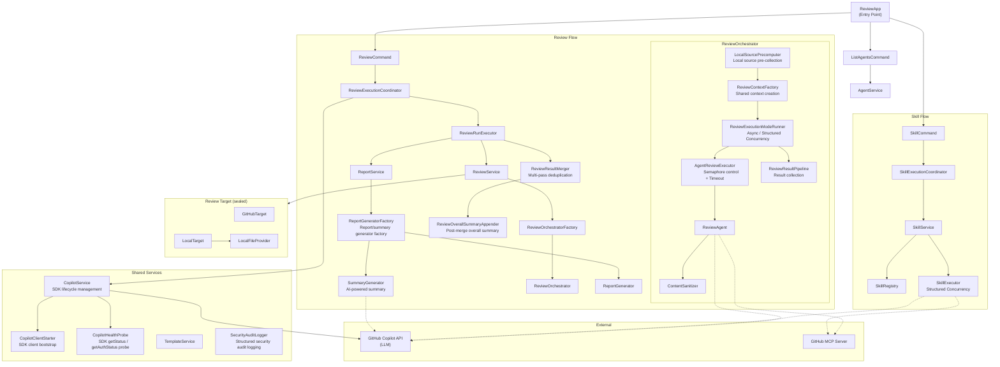

# Multi-Agent Code Reviewer

A parallel code review application using multiple AI agents with GitHub Copilot SDK for Java!

## Features

- **Parallel Multi-Agent Execution**: Simultaneous review from security, code quality, performance, and best practices perspectives
- **GitHub Repository / Local Directory Support**: Review source code from GitHub repositories or local directories
- **Flexible Agent Definitions**: Define agents in GitHub Copilot format (.agent.md)
- **Agent Skill Support**: Define individual skills for agents to execute specific tasks
- **External Configuration Files**: Agent definitions can be swapped without rebuilding
- **Per-Pass Session ID Naming**: Session IDs use `{agent}_{currentPass}of{totalPasses}_{invocationTimestamp}` for traceability
- **Isolated Session Mode**: Disable shared session reuse across passes with `--no-shared-session`
- **LLM Model Selection**: Use different models for review, report generation, and summary generation
- **Structured Review Results**: Consistent format with Priority (Critical/High/Medium/Low)
- **Executive Summary Generation**: Management-facing report aggregating all review results
- **GraalVM Support**: Native binary generation via Native Image
- **Reasoning Model Support**: Automatic reasoning effort configuration for Claude Opus, o3, o4-mini, etc.
- **Multi-Pass Review**: Each agent performs multiple review passes and merges results for improved coverage
- **Content Sanitization**: Automatic removal of LLM preamble text and chain-of-thought leakage from review output
- **Default Model Externalization**: Configure the default model in `application.yml` (changeable without rebuild)
- **Token Lifetime Minimization**: Runtime token handling is narrowed to execution boundaries to reduce in-memory exposure time
- **DI-Consistent Service Construction**: `CopilotService` is unified to DI constructor usage (no no-arg path)
- **Rubber-Duck Peer Discussion Mode**: Two-model dialogue per agent — a primary model and a peer model debate findings across configurable rounds before producing a synthesized final review

## Latest Remediation Status

All review findings from 2026-02-16 through 2026-05-28 review cycles have been fully addressed.

- 2026-05-28 (v2026.05.28-ci-release-hardening): CI and release hardening — changed GitHub Actions workflow defaults to `permissions: {}`, granted `contents: read` only to build jobs and `contents: write` only to the release-publishing job, removed unnecessary release checkout by setting `GH_REPO`, eliminated duplicate OWASP Dependency Check execution from `Supply Chain Guard` so deep auditing is owned by `Dependency Audit`, switched CodeQL Java/Kotlin analysis to `build-mode: none`, fixed dependency submission permissions, refreshed Actions/Maven plugin dependencies, and updated `CopilotCliPathResolver` tests for the latest constructor API.
- 2026-05-15 (v2026.05.15-runtime-compat): Runtime compatibility and report-accuracy fixes — aligned structured concurrency utilities with the JDK 27 `StructuredTaskScope<T, R, R_X>` signature while preserving await-all behavior, removed macOS-specific `/bin/true` test dependency, expanded trusted CLI real-path allowlist for Homebrew `Cellar`/`Caskroom` (fixing both `gh auth token` fallback and `copilot` discovery), normalized Copilot SDK log-level mapping (`warn` -> `warning`), fixed deny-all permission serialization by returning typed `REJECTED`, and excluded "no findings" placeholder blocks from findings aggregation. Verified with `mvn clean package` (830 tests passing).
- 2026-05-15 (v2026.05.15-sdk-refactor): Copilot SDK for Java native-feature alignment refactor (Phases 1–3) — typed MCP server handoff with `McpHttpServerConfig` instead of `Map<String, Object>` casts (Phase 1, commit `96df653`); replaced subprocess-based `CopilotCliHealthChecker` with SDK `client.getStatus()` / `getAuthStatus()` based `CopilotHealthProbe`, set `setAutoRestart(true)` and env-driven `setLogLevel(...)`, rewrote `DoctorCommand` on top of the SDK probe (Phase 2, commit `b657c64` + corrections in `a9310fc`); migrated `ReviewSessionMessageSender`, `ReviewAgent`, and `RubberDuckDialogueExecutor` from custom event subscription + idle-timeout watchdog to SDK `session.sendAndWait(MessageOptions, timeoutMs)` with a defensive `AssistantMessageEvent` accumulator for the empty-final-response edge case (Phase 3b, commit `868aafe`); deleted `IdleTimeoutScheduler`, `EventSubscriptions`, `ReviewSessionEvents`, `ContentCollector`, `SessionEventException` and pruned `sharedScheduler` plumbing from orchestrator/context, reducing `AgentTuningConfig` and `BufferSettings` to a single field (Phase 3c, commit `293f2e5`). Net change across phases: ~ -1,100 production LoC. Verified with `mvn test` (820 passing; one pre-existing `/bin/true` env-dependent error in `CliPathResolverTest`).
- 2026-04-30 (v2026.04.30-copilot-sdk-stable): Copilot SDK stable migration and CI alignment — upgraded `copilot.sdk.version` from preview `0.3.0-java-preview.1` to stable `0.3.0-java.2`, normalized GitHub Actions `JDK_VERSION` from `26.0.1` to `26` across `ci.yml`/`codeql.yml`/`dependency-audit.yml`/`release.yml`, pinned the CycloneDX Maven plugin to `2.9.1` in the release workflow with the SBOM step refactored for readability, and granted job-level `permissions: contents: write` to the `publish-release` job so `gh release create` succeeds under the workflow-level least-privilege default (`contents: read`). Verified with `mvn clean package` on Java 26
- 2026-04-30 (v2026.04.30-micronaut5-snapshot): Micronaut 5 SNAPSHOT tracking — upgraded `io.micronaut.platform:micronaut-parent` and `micronaut.version` to `5.0.0-SNAPSHOT`, added Sonatype Central Snapshots repository for both dependencies and plugins, temporarily disabled the SNAPSHOT-blocking enforcer rule with an annotated TODO, and configured `micronaut-maven-plugin` with `<configurationValidation><failOnNotPresent>false</failOnNotPresent></configurationValidation>` so the new Micronaut 5 strict validator does not misclassify `-Amicronaut.processing.*` annotation processor arguments as unknown configuration properties. Verified with `mvn clean package` (BUILD SUCCESS) and 829 passing tests on Java 26 (Oracle 26.0.1)
- 2026-04-23 (v2026.04.23-copilot-sdk-compat): Copilot SDK compatibility alignment — upgraded `copilot.sdk.version` to `0.3.0-java-preview.1`, migrated event imports from `com.github.copilot.sdk.events.*` to `com.github.copilot.sdk.generated.*`, and updated MCP server handoff to satisfy the new `setMcpServers(Map<String, McpServerConfig>)` type requirement. Verified with `./mvnw -q -DskipTests compile`
- 2026-04-14 (v2026.04.14-model-auth-check): Model/auth-check alignment — updated bundled agent frontmatter models from `GPT-5.3-Codex` to `claude-opus-4.6-1m`, kept default model alignment consistent across runtime config and bundled agents, and improved Copilot CLI auth pre-check fallback compatibility (PR #121)
- 2026-04-14 (v2026.04.14-rubber-duck): Rubber-duck peer discussion review mode added — introduced agent-level two-model dialogue with synthesized final output, CLI/config support (`--rubber-duck`, `--dialogue-rounds`, `--peer-model`, `reviewer.rubber-duck.*`), timeout/mode handling alignment for rubber-duck execution, and dependency update `org.owasp:dependency-check-maven` 12.2.1 (PRs #119/#118)
- 2026-03-18 (v2026.03.18-auth): OAuth device-flow alignment — switched Copilot auth to logged-in user flow, removed `GITHUB_TOKEN`-centric guidance from runtime/CLI/docs, and synchronized README EN/JA + release notes. Verified with `mvn clean test` (743 passing)
- 2026-03-05 (v2026.03.05-notes): Performance/security improvements and codebase cleanup — `LocalFileCandidateProcessor` double-buffering avoidance, `GitHubTokenResolver` child process token propagation prevention, `CliPathResolver` trusted directory validation, `FrontmatterParser` YAML DoS resistance, `SensitiveHeaderMasking` pattern expansion, Java 26 migration, structured concurrency path unification, `CopilotPermissionHandlers` centralization, obsolete custom instruction class removal. PRs #85/#86/#87/#88/#89/#90 merged
- 2026-03-05 (v2026.03.05): **Breaking change** — Discontinued custom instruction support, migrated to agent skills only. Removed `--instructions`/`--no-instructions`/`--no-prompts` CLI options. Created 4 new agent skills from custom instructions (java-best-practices, java-bug-patterns, spring-boot-review, vuejs3-review). Completed all 16 complexity refactorings (5 HIGH + 9 MEDIUM + 2 LOW). Aligned micronaut.version with parent 4.10.9
- 2026-03-04 (v2026.03.04):Security fixes & dependency updates — pinned jackson-core to 2.21.1 (GHSA-72hv-8253-57qq), replaced ReDoS-prone regex with loop (CodeQL alert #9), bumped Copilot SDK to 1.0.10, bumped actions/checkout to 6.0.2, introduced OWASP Dependency Check in CI. PRs #75/#76/#77/#78/#79/#80 merged
- 2026-03-03 (v2026.03.03):Report generation flow improvement — generate per-pass review reports without overall summary, merge after all passes complete, recount finding severity from the merged report content to append an accurate overall summary, and deduplicate identical findings across agents in the executive summary with review category listing. Code-quality remediation including DRY/responsibility separation/Optional/type-safety improvements. PRs #72/#73 merged
- 2026-03-02 (v2026.03.02-notes): Report merge remediation finalization — unified duplicate-finding merge behavior, enforced merged-findings-based overall summary generation across all report paths, completed post-merge summary behavior alignment in PRs #57/#58/#59, and updated Micronaut to 4.10.9
- 2026-02-19 (v12): Best-practices remediation — simplified `TemplateService` cache synchronization with deterministic LRU behavior, replaced `SkillService` manual executor-cache management with Caffeine eviction + close-on-evict, abstracted CLI token input handling (`CliParsing.TokenInput`) from direct system I/O, simplified `ContentCollector` joined-content cache locking, improved section parsing readability in `AgentMarkdownParser`, made multi-pass start logging in `ReviewExecutionModeRunner` accurate, completed delegation methods in `GithubMcpConfig` map wrappers, simplified `ReviewResult` default timestamp handling, removed FQCN utility usage in `SkillExecutor`, and clarified concurrency/threading design intent in `CopilotService` and `ReviewOrchestrator`
- 2026-02-19 (v11): Code quality remediation — centralized token hashing via shared `TokenHashUtils`, unified orchestrator failure-result generation with `ReviewResult.failedResults(...)`, extracted orchestrator nested types (`OrchestratorConfig`, `PromptTexts`, and collaborator interfaces/records) into top-level package types, refactored scoped-instruction loading to avoid stream-side-effect try/catch blocks, introduced grouped execution settings (`ConcurrencySettings`, `TimeoutSettings`, `RetrySettings`, `BufferSettings`) with factory access, removed dead code (`ReviewResultPipeline.collectFromFutures`) and unused similarity field, and added dedicated command tests for `ReviewCommand` / `SkillCommand`
- 2026-02-19 (v10): Performance + WAF security hardening — eliminated redundant finding-key extraction in merge flow, added prefix-indexed near-duplicate lookup, optimized local file read buffer sizing, precompiled fallback whitespace regex, introduced structured security audit logging, enforced SDK WARN level even in verbose mode, applied owner-only report output permissions on POSIX, added Maven `dependencyConvergence`, and added weekly OWASP dependency-audit workflow
- 2026-02-19 (v9): Security follow-up closure — expanded suspicious-pattern validation for agent definitions to all prompt-injected fields, strengthened MCP header masking paths (`entrySet`/`values` stringification), and reduced token exposure by deferring `--token -` stdin materialization to resolution time
- 2026-02-19 (v8): Naming-rule alignment — synchronized executive summary output to `reports/{owner}/{repo}/executive_summary_yyyy-mm-dd-HH-mm-ss.md` (CLI invocation timestamp) and aligned README EN/JA examples + tests
- 2026-02-19 (v7): Security report follow-up — synchronized `LocalFileConfig` fallback sensitive file patterns with resource defaults and added an opt-in `security-audit` Maven profile (`dependency-check-maven`)
- 2026-02-19 (v6): Release documentation rollup — published the 2026-02-19 daily rollup section in RELEASE_NOTES EN/JA
- 2026-02-19 (v5): Documentation refinement — added concise operations summary for the v2-v4 progression
- 2026-02-19 (v4): Documentation sync — refreshed Operational Completion Check to 2026-02-19 and recorded PR #76 completion
- 2026-02-19 (v3): Reliability remediation — tolerate idle-timeout scheduler shutdown to prevent `RejectedExecutionException` retry storms
- 2026-02-19 (v2): CI consistency remediation — aligned CodeQL workflow JDK from 26 to 25 to match Java 25.0.2 policy
- 2026-02-19 (v1): Multi-pass review performance remediation — reuse `CopilotSession` across passes in the same agent and refactor orchestration to per-agent pass execution
- 2026-02-18: Best practices review remediation — compact constructors & defensive copies, SLF4J stack trace logging improvements, config record extensions, SkillConfig.defaults() factory method
- 2026-02-17 (v2): PRs #34–#40 — Security, performance, code quality, best practices fixes + 108 new tests
- 2026-02-17 (v1): PRs #22–#27 — Final remediation (PR-1 to PR-5)
- Operations summary (2026-02-19 v2-v4): Java 25 CI alignment (PR #74) → idle-timeout scheduler resilience fix (PR #76) → operational completion checklist sync (PR #78)
- Release details: `RELEASE_NOTES_en.md`
- GitHub Release: https://github.com/anishi1222/multi-agent-code-reviewer/releases/tag/v2026.05.28-ci-release-hardening

## Operational Completion Check (2026-02-19)

- Last updated: 2026-02-19 (v12)

- [x] All review findings addressed
- [x] Full test suite passing (0 failures)
- [x] Reliability fix PR merged: #76 (idle-timeout scheduler shutdown fallback)
- [x] Sensitive-pattern fallback sync completed (`LocalFileConfig`)
- [x] Executive summary filename aligned to naming convention (`executive_summary_yyyy-mm-dd-HH-mm-ss.md`)
- [x] Agent definition suspicious-pattern validation expanded to all prompt-injected fields
- [x] MCP auth header masking reinforced for `entrySet` / `values` stringification paths
- [x] `--token -` handling deferred to token-resolution boundary to minimize in-memory token lifetime
- [x] Merge-path redundant normalization/regex extraction removed (`findingKeyFromNormalized` reuse)
- [x] Near-duplicate detection narrowed with priority+title-prefix index before similarity matching
- [x] Local file reader pre-sizes `ByteArrayOutputStream` based on expected file size
- [x] Fallback summary whitespace regex switched to precompiled pattern
- [x] Structured `SECURITY_AUDIT` logging added for auth/trust/instruction-validation events
- [x] `--verbose` mode keeps Copilot SDK logger at `WARN`
- [x] Report output directories/files use owner-only POSIX permissions where supported
- [x] Weekly scheduled OWASP dependency audit workflow added
- [x] SHA-256 token hashing unified via shared utility (`TokenHashUtils`)
- [x] Orchestrator failure results unified (`ReviewResult.failedResults`)
- [x] `ReviewOrchestrator` nested collaborator/config types extracted to top-level package types
- [x] Scoped instruction loading refactored to explicit file loop + isolated IO handling
- [x] `ExecutionConfig` grouped settings/factory added to reduce positional constructor risk
- [x] Dead code removed (`ReviewResultPipeline.collectFromFutures`, unused `ReviewFindingSimilarity.WHITESPACE`)
- [x] `ReviewCommand` and `SkillCommand` unit tests added (normal/help/error)
- [x] `TemplateService` cache synchronization simplified with deterministic LRU behavior preserved
- [x] `SkillService` executor cache moved to Caffeine with eviction-time executor close
- [x] CLI token input abstracted from direct system I/O (`CliParsing.TokenInput`)
- [x] `ContentCollector` joined-content cache locking simplified
- [x] `AgentMarkdownParser` section parsing readability improved (removed iterable-cast trick)
- [x] `ReviewExecutionModeRunner` multi-pass start logging made execution-accurate
- [x] `GithubMcpConfig` map wrappers completed delegation methods (`isEmpty`/`containsValue`/`keySet`/`values`)
- [x] `ReviewResult` default timestamp handling simplified
- [x] `SkillExecutor` FQCN utility call removed (`ExecutorUtils` import)
- [x] Concurrency/threading design intent documentation reinforced (`CopilotService`, `ReviewOrchestrator`)
- [x] README EN/JA synchronized

## Release Update Procedure (Template)

Reference checklist: `reports/anishi1222/multi-agent-code-reviewer/documentation_sync_checklist_2026-02-17.md`

1. Add a new date section to `RELEASE_NOTES_en.md` and `RELEASE_NOTES_ja.md` with matching structure.
2. Create and push an annotated tag (for example: `vYYYY.MM.DD-notes`).
3. Publish a GitHub Release from the tag and include EN/JA notes summary.
4. Update `README_en.md` and `README_ja.md` with release references and URLs.

## Release Operation Checklist

- [ ] Add the same release date section to `RELEASE_NOTES_en.md` and `RELEASE_NOTES_ja.md`.
- [ ] Update release references in `README_en.md` and `README_ja.md`.
- [ ] Commit on a feature/docs branch and open a PR (do not push directly to `main`).
- [ ] Confirm required checks are green (Supply Chain Guard, Build and Test, Build Native Image, dependency-review, submit-maven).
- [ ] Merge the PR and fast-forward local `main`.
- [ ] Create and push an annotated tag: `git tag -a vYYYY.MM.DD-notes -m "Release notes update for YYYY-MM-DD"` then `git push origin vYYYY.MM.DD-notes`.
- [ ] Create GitHub Release from the tag with EN/JA summary notes.

## Requirements

- **JDK 27** (preview features enabled for runtime commands)
- **GraalVM** (optional, only required for `-Pnative` native-image builds)
- GitHub Copilot CLI 0.0.407 or later
- GitHub CLI login (`gh auth login`) for repository access
- GitHub Copilot CLI login (`gh copilot -- login` or `copilot login`) for Copilot SDK access

## Supply Chain Policy

This repository enforces dependency and build hygiene in both Maven and GitHub Actions.

- Maven validate/build fails when checksum verification fails for Central artifacts.
- SNAPSHOT dependencies/plugins are blocked by Maven Enforcer.
- PR dependency review fails on vulnerability severity `moderate` or higher.
- PR dependency review denies these licenses: `GPL-2.0`, `GPL-3.0`, `AGPL-3.0`, `LGPL-2.1`, `LGPL-3.0`.
- `Supply Chain Guard` runs Maven `validate` policy checks without duplicating OWASP vulnerability scanning.
- `Dependency Audit` owns OWASP `dependency-check-maven` execution via `mvn -Psecurity-audit verify`.

Recommended branch protection required checks:

- `Supply Chain Guard`
- `Build and Test`
- `Dependency Review`

### Installing the SDKMAN-managed JDK

Using SDKMAN:

```bash
sdk env install
sdk env

# Confirm active Java version
java -version
```

## Installation

```bash
# Clone the repository
git clone https://github.com/your-org/multi-agent-reviewer.git
cd multi-agent-reviewer

# Build (JAR file)
./mvnw clean package

# Build native image (optional)
./mvnw clean package -Pnative
```

### Test Troubleshooting

If tests fail with `NoSuchMethodError` for synthetic methods such as `access$0`, run a clean rebuild to remove stale class outputs:

```bash
./mvnw clean test
```

## Usage

> Note: This project uses Java preview features. Run the JVM JAR with `--enable-preview`.

### Security Runtime Notes

When running on the JVM in production and handling GitHub tokens, consider:

```bash
java --enable-preview \
  -XX:+DisableAttachMechanism \
  -XX:-HeapDumpOnOutOfMemoryError \
  -jar target/multi-agent-reviewer-1.0.0-SNAPSHOT.jar run --repo owner/repository --all
```

- `-XX:+DisableAttachMechanism`: helps reduce token exposure via runtime attach/debug interfaces.
- `-XX:-HeapDumpOnOutOfMemoryError`: prevents automatic heap dumps that can contain token `String` data.
- If your operations require heap dumps, write them to a tightly access-controlled location and keep retention short.

### Basic Usage

```bash
# Run review with all agents (GitHub repository)
java --enable-preview -jar target/multi-agent-reviewer-1.0.0-SNAPSHOT.jar \
  run \
  --repo owner/repository \
  --all

# Review a local directory
java --enable-preview -jar target/multi-agent-reviewer-1.0.0-SNAPSHOT.jar \
  run \
  --local ./my-project \
  --all

# Run only specific agents
java --enable-preview -jar target/multi-agent-reviewer-1.0.0-SNAPSHOT.jar \
  run \
  --repo owner/repository \
  --agents security,performance

# Explicitly specify LLM models
java --enable-preview -jar target/multi-agent-reviewer-1.0.0-SNAPSHOT.jar \
  run \
  --repo owner/repository \
  --all \
  --review-model gpt-4.1 \
  --summary-model claude-sonnet-4

# Run with isolated sessions per pass
java --enable-preview -jar target/multi-agent-reviewer-1.0.0-SNAPSHOT.jar \
  run \
  --repo owner/repository \
  --all \
  --no-shared-session

# List available agents
java --enable-preview -jar target/multi-agent-reviewer-1.0.0-SNAPSHOT.jar \
  list
```

### Run Options

| Option | Short | Description | Default |
|--------|-------|-------------|---------|
| `--repo` | `-r` | Target GitHub repository (exclusive with `--local`) | - |
| `--local` | `-l` | Target local directory (exclusive with `--repo`) | - |
| `--agents` | `-a` | Agents to run (comma-separated) | - |
| `--all` | - | Run all agents | false |
| `--output` | `-o` | Output base directory | `./reports` |
| `--agents-dir` | - | Additional agent definition directory | - |
| `--token` | - | GitHub token input (`-` for stdin only; direct value is rejected) | `gh auth token` |
| `--parallelism` | - | Number of parallel executions | 4 |
| `--no-summary` | - | Skip summary generation | false |
| `--no-shared-session` | - | Force isolated session per review pass (disable shared session reuse) | false |
| `--rubber-duck` | - | Enable rubber-duck peer-discussion review mode | false |
| `--dialogue-rounds` | - | Override rubber-duck dialogue rounds (1–10) | 2 |
| `--peer-model` | - | Override peer model for rubber-duck mode (must differ from review model) | - |
| `--model` | - | Default model for all stages | - |
| `--review-model` | - | Model for review | Agent config |
| `--report-model` | - | Model for report generation | review-model |
| `--summary-model` | - | Model for summary generation | default-model |
| `--help` | `-h` | Show help | - |
| `--version` | `-V` | Show version | - |
| `--verbose` | `-v` | Enable verbose logging (debug level) | - |

### List Subcommand

Displays a list of available agents. Additional directories can be specified with `--agents-dir`.

### Environment Variables

| Variable | Description | Default |
|----------|-------------|--------|
| `COPILOT_CLI_PATH` | Path to the Copilot CLI binary | Auto-detected from PATH |
| `GH_CLI_PATH` | Path to the GitHub CLI binary | Auto-detected from PATH |
| `GH_AUTH_FALLBACK_ENABLED` | Enable fallback from stdin token to `gh auth token` | false |
| `COPILOT_SDK_LOG_LEVEL` | Copilot SDK/CLI log level (`none,error,warning,info,debug,all,default`; `warn/off/trace` aliases supported) | warning |
| `COPILOT_START_TIMEOUT_SECONDS` | Copilot client start timeout (seconds) | 60 |
| `COPILOT_CLI_HEALTHCHECK_SECONDS` | CLI health check timeout (seconds) | 10 |
| `COPILOT_CLI_AUTHCHECK_SECONDS` | CLI auth check timeout (seconds) | 15 |
| `RUBBER_DUCK_PEER_MODEL` | Default peer model for rubber-duck mode | *(none)* |

Auto-detected CLI paths are revalidated against trusted real-path directories:
`/usr/bin`, `/usr/local/bin`, `/bin`, `/opt/homebrew/bin`, `/usr/local/Cellar`, `/opt/homebrew/Cellar`, `/usr/local/Caskroom`, `/opt/homebrew/Caskroom`.

```bash
gh auth login
gh copilot -- login
```

If available in your environment, `copilot login` can be used instead of `gh copilot -- login`.

### Session Behavior

By default, multi-pass reviews reuse one shared session per agent. To isolate each pass in its own session, use `--no-shared-session`.

```bash
java --enable-preview -jar target/multi-agent-reviewer-1.0.0-SNAPSHOT.jar \
  run \
  --repo owner/repository \
  --all \
  --no-shared-session
```

### Local Directory Review

You can review source code from a local directory even when you cannot access a GitHub repository.

```bash
# Review a local project
java -jar target/multi-agent-reviewer-1.0.0-SNAPSHOT.jar \
  run \
  --local /path/to/project \
  --all
```

Supported file extensions:
- JVM: `.java`, `.kt`, `.kts`, `.groovy`, `.scala`, `.clj`
- Web: `.js`, `.jsx`, `.ts`, `.tsx`, `.mjs`, `.cjs`, `.vue`, `.svelte`
- Systems: `.c`, `.cpp`, `.cc`, `.cxx`, `.h`, `.hpp`, `.rs`, `.go`, `.zig`
- Scripting: `.py`, `.rb`, `.php`, `.pl`, `.pm`, `.lua`, `.r`
- Shell: `.sh`, `.bash`, `.zsh`, `.fish`, `.ps1`, `.psm1`
- .NET: `.cs`, `.fs`, `.vb`
- Mobile: `.swift`, `.m`, `.mm`
- Data/Config: `.sql`, `.graphql`, `.gql`, `.proto`, `.yaml`, `.yml`, `.json`, `.toml`, `.xml`, `.properties`
- Build: `.gradle`, `.cmake`, `.makefile`
- Docs: `.md`, `.rst`, `.adoc`

> **Note**: Files up to 256 KB each are collected, with a 2 MB total limit. Files that may contain sensitive information (`application-prod`, `.env`, `keystore`, etc.) are automatically excluded.

### Review Inputs

Custom instruction inputs via CLI were removed in v2026.03.05. Use agent skills under `.github/skills/` to provide domain-specific review guidance.

### Output Example

Reports are generated under the output base directory in a subdirectory corresponding to the review target plus the CLI invocation timestamp.

**GitHub repository** (`--repo owner/repository`):
```
./reports/
└── owner/
    └── repository/
      ├── executive_summary_2026-02-19-18-38-42.md
      └── 2026-02-19-18-38-42/
        ├── security-report.md
        ├── code-quality-report.md
        ├── performance-report.md
        └── best-practices-report.md
```

**Local directory** (`--local /path/to/my-project`):
```
./reports/
└── my-project/
  ├── executive_summary_2026-02-19-18-38-42.md
  └── 2026-02-19-18-38-42/
    ├── security-report.md
    ├── code-quality-report.md
    ├── performance-report.md
    └── best-practices-report.md
```

Use `-o` / `--output` to change the output base directory (default: `./reports`).

Pass-level intermediate reports are written under `.checkpoints/passes` during execution and cleaned up automatically when the CLI exits.

## Configuration

Customize application behavior via `application.yml`.

```yaml
reviewer:
  agents:
    directories:                      # Agent definition search directories
      - ./agents
      - ./.github/agents
  execution:
    shared-session-enabled: true # Reuse one session per agent across passes (default)
    concurrency:
      parallelism: 4             # Default parallel execution count
      review-passes: 3           # Number of review passes per agent (multi-pass review)
    timeouts:
      orchestrator-timeout-minutes: 45  # Orchestrator timeout (minutes)
      agent-timeout-minutes: 20          # Agent timeout (minutes)
      idle-timeout-minutes: 5            # Idle timeout (minutes)
      skill-timeout-minutes: 20          # Skill timeout (minutes)
      summary-timeout-minutes: 20        # Summary timeout (minutes)
      gh-auth-timeout-seconds: 30        # GitHub auth timeout (seconds)
    retry:
      max-retries: 2             # Max retry count on review failure
  local-files:
    max-file-size: 262144               # Max local file size (256KB)
    max-total-size: 2097152             # Max total local file size (2MB)
  templates:
    directory: templates              # Template directory
    output-constraints: output-constraints.md  # Output constraints (CoT suppression, language)
  skills:
    filename: SKILL.md                    # Skill definition filename
    directory: .github/skills             # Skill definitions directory
  mcp:
    github:
      type: http
      url: https://api.githubcopilot.com/mcp/
      tools:
        - "*"
      auth-header-name: Authorization
      auth-header-template: "Bearer {token}"
  models:
    default-model: claude-sonnet-4.5  # Default for all models (changeable without rebuild)
    review-model: GPT-5.3-Codex      # Model for review
    report-model: claude-opus-4.6-fast  # Model for report generation
    summary-model: claude-sonnet-4.5 # Model for summary generation
    reasoning-effort: high           # Reasoning effort level (low/medium/high)
  summary:
    max-content-per-agent: 50000     # Max characters per agent content for summary prompt
    max-total-prompt-content: 200000 # Max total prompt characters for summary generation
    fallback-excerpt-length: 180     # Excerpt length used by fallback summary formatter
  rubber-duck:
    enabled: false                   # Enable rubber-duck peer-discussion mode globally
    dialogue-rounds: 2               # Number of dialogue rounds (1–10)
    peer-model: ${RUBBER_DUCK_PEER_MODEL:}  # Peer model (env var or explicit)
    synthesis-strategy: last-responder  # last-responder | dedicated-session
```

### External Configuration Override

When running as a fat JAR or Native Image, you can override the built-in `application.yml` without rebuilding.

**Place `application.yml` in the working directory:**

```bash
# Fat JAR
cp application.yml ./
java -jar multi-agent-code-reviewer.jar

# Native Image
cp application.yml ./
./multi-agent-code-reviewer
```

**Or specify an explicit path via system property:**

```bash
# Fat JAR
java -Dmicronaut.config.files=/path/to/application.yml -jar multi-agent-code-reviewer.jar

# Native Image
./multi-agent-code-reviewer -Dmicronaut.config.files=/path/to/application.yml
```

**Or override individual properties via environment variables:**

```bash
export REVIEWER_MODELS_DEFAULT_MODEL=gpt-4
export REVIEWER_EXECUTION_PARALLELISM=8
java -jar multi-agent-code-reviewer.jar
```

> **Note:** The external `application.yml` only needs to contain the properties you want to override — you do not need to copy the entire file.

Configuration is resolved in the following priority order (highest first):

1. CLI options (`--review-model`, `--parallelism`, etc.)
2. System properties (`-Dreviewer.models.default-model=...`)
3. Environment variables (`REVIEWER_MODELS_DEFAULT_MODEL=...`)
4. External `application.yml` (working directory or `-Dmicronaut.config.files`)
5. Built-in `application.yml` (inside the JAR / Native Image)
6. Hardcoded defaults in record constructors

### Model Configuration Priority

Models are resolved in the following priority order:

1. **Individual model settings** (`review-model`, `report-model`, `summary-model`) take highest priority
2. **Default model** (`default-model`) — fallback when no individual setting is specified
3. **Hardcoded constant** (`ModelConfig.DEFAULT_MODEL`) — final fallback when nothing is configured in YAML

### Multi-Pass Review

Each agent can perform multiple review passes, merging the results to catch issues that a single pass might miss.

- **`review-passes`** controls the number of review passes per agent (default: `1`)
- All passes are submitted concurrently to the Virtual Thread pool, with `parallelism` controlling the maximum concurrent tasks
- Example: 4 agents × 2 passes = 8 tasks queued in parallel; with `parallelism=4`, up to 4 run concurrently
- Duplicate findings within the same agent are aggregated into a single deduplicated report
- Aggregated output can include pass-detection information to preserve traceability for repeated findings
- If some passes fail, results from the successful passes are still used
- The executive summary is generated from the merged, multi-pass results

### Retry Behavior

When an agent review fails due to timeout or empty response, it is automatically retried.

- **Timeout is per-attempt, not cumulative**: `agent-timeout-minutes` applies independently to each attempt. For example, with `agent-timeout-minutes: 20` and `max-retries: 2`, the agent will try up to 3 times (initial + 2 retries) × 20 minutes each = up to 60 minutes total
- **Returns immediately on success**: If any attempt succeeds, remaining retries are skipped
- **Set `max-retries: 0`** to disable retries
- Retried on: timeout (`TimeoutException`), empty response, SDK exceptions

### Rubber-Duck Peer Discussion Mode

Each agent can optionally run in **rubber-duck mode**, where two different LLM models debate review findings in a multi-round dialogue before producing a synthesized final review.

```bash
# Enable rubber-duck mode for all agents
java --enable-preview -jar target/multi-agent-reviewer-1.0.0-SNAPSHOT.jar \
  run \
  --repo owner/repository \
  --all \
  --rubber-duck \
  --peer-model gpt-4.1

# With custom dialogue rounds
java --enable-preview -jar target/multi-agent-reviewer-1.0.0-SNAPSHOT.jar \
  run \
  --repo owner/repository \
  --all \
  --rubber-duck \
  --peer-model gpt-4.1 \
  --dialogue-rounds 3
```

**How it works:**
1. **Session A** (agent's model) performs the initial review.
2. **Session B** (peer model) provides a peer review of Session A's findings.
3. Subsequent rounds alternate counter-arguments between the two models.
4. After all rounds, a synthesis prompt merges both perspectives into a single unified review.

**Key constraints:**
- The **peer model must differ** from the agent's review model — same-model pairing is rejected.
- When rubber-duck mode is enabled, **multi-pass review is forced to 1 pass** per agent. The dialogue itself replaces multi-pass coverage.
- Timeout is automatically scaled based on the number of dialogue rounds.
- Specifying `--peer-model` or `--dialogue-rounds` on the CLI **auto-enables** rubber-duck mode (no need to also pass `--rubber-duck`).

**Synthesis strategies** (configurable via `reviewer.rubber-duck.synthesis-strategy`):
- `last-responder` (default): The synthesis prompt is sent to the last active session (Session B).
- `dedicated-session`: A new third session is created specifically for synthesis.

**Per-agent configuration:** Rubber-duck settings can also be specified per-agent in `.agent.md` frontmatter (see Agent Definition File section).

### Agent Directories

The following directories are automatically searched:

- `./agents/` - Default directory
- `./.github/agents/` - Alternative directory

Additional directories can be specified with the `--agents-dir` option.

### Agent Definition File (`.agent.md`)

Following the GitHub Copilot Custom Agent format, all section names are in English. Recognized sections:

| Section | Description |
|---------|-------------|
| `## Role` | Agent role / system prompt |
| `## Instruction` | Review instruction prompt |
| `## Focus Areas` | List of review focus areas |
| `## Output Format` | Output format specification |

In `Instruction`, you can use placeholders: `${repository}`, `${displayName}`, `${focusAreas}`.

Additional frontmatter fields for rubber-duck mode:

| Key | Type | Default | Description |
|-----|------|---------|-------------|
| `peer-model` | string | *(global config)* | Per-agent peer model override |
| `rubber-duck` | boolean | `false` | Enable rubber-duck mode for this agent |
| `dialogue-rounds` | int | `0` (defer to global) | Per-agent dialogue rounds override |
| `language` | string | `ja` | Template language for rubber-duck prompts (`ja`/`en`) |

```markdown
---
name: security
description: "Security Review"
model: claude-sonnet-4
---

# Security Review Agent

## Role

You are a security-focused code reviewer.
As an experienced security engineer, you identify vulnerabilities in the code.

## Instruction

Please perform a code review of the following GitHub repository.

**Target Repository**: ${repository}

Analyze all source code in the repository and identify issues from your specialty perspective (${displayName}).

Pay special attention to the following points:
${focusAreas}

## Focus Areas

- SQL Injection
- XSS Vulnerabilities
- Authentication/Authorization Issues

## Output Format

Please output the review results in the following format.
```

### Default Agents

| Agent | Description |
|-------|-------------|
| `security` | Security vulnerabilities, authentication/authorization, secrets |
| `code-quality` | Readability, complexity, SOLID principles, tests |
| `performance` | N+1 queries, memory leaks, algorithm efficiency |
| `best-practices` | Language/framework-specific best practices |
| `waf-reliability` | Azure WAF Reliability — retry, circuit breaker, timeout, disaster recovery |
| `waf-security` | Azure WAF Security — managed identity, Key Vault, zero trust, RBAC |
| `waf-cost-optimization` | Azure WAF Cost Optimization — SKU selection, autoscaling, idle resources |
| `waf-operational-excellence` | Azure WAF Operational Excellence — IaC, CI/CD, structured logging, Application Insights |
| `waf-performance-efficiency` | Azure WAF Performance Efficiency — caching, async messaging, connection pooling |

## Review Result Format

Each finding is output in the following format:

| Field | Description |
|-------|-------------|
| Title | Concise title describing the issue |
| Priority | Critical / High / Medium / Low |
| Summary | Description of the problem |
| Impact if Not Fixed | Risk if left unaddressed |
| Location | File path and line numbers |
| Recommended Action | Specific fix (including code examples) |
| Benefit | Improvement from the fix |

### Priority Criteria

- **Critical**: Security vulnerabilities, data loss, production outages. Immediate action required
- **High**: Serious bugs, performance issues. Prompt action needed
- **Medium**: Code quality issues, reduced maintainability. Address in planned manner
- **Low**: Style issues, minor improvement suggestions. Fix when time permits

## Agent Skill

Agents can have individual skills defined to execute specific tasks.

### skill Subcommand

```bash
# List available skills
java -jar target/multi-agent-reviewer-1.0.0-SNAPSHOT.jar \
  skill --list

# Execute a skill
java -jar target/multi-agent-reviewer-1.0.0-SNAPSHOT.jar \
  skill sql-injection-check \
  --param target=owner/repository

# Execute a skill with parameters
java -jar target/multi-agent-reviewer-1.0.0-SNAPSHOT.jar \
  skill secret-scan \
  --param repository=owner/repository \
  --model claude-sonnet-4
```

### skill Options

| Option | Short | Description | Default |
|--------|-------|-------------|---------|
| `--list` | - | List available skills | - |
| `--param` | `-p` | Parameter (key=value format) | - |
| `--token` | - | GitHub token input (`-` for stdin only; direct value is rejected) | `gh auth token` |
| `--model` | - | LLM model to use | default-model |
| `--agents-dir` | - | Agent definitions directory | - |

### Skill Definition (`SKILL.md` format)

Skills are defined as standalone `SKILL.md` files placed in `.github/skills/<skill-name>/` directories. Each skill is a separate directory containing a `SKILL.md` file with YAML frontmatter and a Markdown body.

```
.github/skills/
├── sql-injection-check/
│   └── SKILL.md
├── secret-scan/
│   └── SKILL.md
├── complexity-analysis/
│   └── SKILL.md
└── ...
```

#### SKILL.md Format

```markdown
---
name: secret-scan
description: Detects hardcoded secrets in code such as API keys, tokens, passwords, private keys, and cloud credentials.
metadata:
  agent: security
---

# Secret Scan

Analyze the following code for secret leakage.

**Target Repository**: ${repository}

Look for these patterns:
- API keys, tokens
- Passwords
- Private keys
- Database connection strings
- AWS/Azure/GCP credentials

Report discovered secrets and recommend proper management approaches.
```

| Field | Description |
|-------|-------------|
| `name` | Skill name (defaults to directory name if omitted) |
| `description` | Skill description |
| `metadata.agent` | Agent to bind this skill to (e.g. `security`, `code-quality`). If omitted, available to all agents |
| Body | The prompt template. Supports `${paramName}` placeholders substituted at runtime |

## GraalVM Native Image

To build as a native binary:

```bash
# Build native image
./mvnw clean package -Pnative

# Run
./target/review run --repo owner/repository --all
```

### Generating Reflection Configuration (First Build / After Dependency Updates)

The Copilot SDK internally uses Jackson Databind for JSON-RPC communication. Because GraalVM Native Image restricts reflection, reflection configuration must be registered in advance for the SDK's internal DTO classes.

If the configuration is missing, the Native Image binary will time out when communicating with the Copilot CLI (this does not occur with the FAT JAR). This happens because Jackson performs JSON serialization/deserialization via reflection, and in a Native Image environment, metadata for unregistered classes is inaccessible. Exceptions are silently caught inside the SDK, leaving `CompletableFuture` instances permanently incomplete.

Use the GraalVM **tracing agent** to automatically collect the required reflection information from an actual execution.

```bash
# 1. Build the FAT JAR first
./mvnw clean package -DskipTests

# 2. Run with the tracing agent to auto-generate reflection configuration
#    Use config-merge-dir to merge with existing configuration
java -agentlib:native-image-agent=config-merge-dir=src/main/resources/META-INF/native-image \
     -jar target/multi-agent-reviewer-1.0.0-SNAPSHOT.jar \
     run --repo owner/repository --all

# 3. Verify the generated configuration
ls src/main/resources/META-INF/native-image/
# reflect-config.json, resource-config.json, proxy-config.json, etc. are generated/updated

# 4. Rebuild as Native Image
./mvnw clean package -Pnative -DskipTests
```

> **Note**: Use `config-merge-dir` instead of `config-output-dir` to merge with existing configurations (e.g., Logback) rather than overwriting them. Also, run all agents (security, performance, etc.) to exercise all code paths and generate complete configuration.

> **Tip**: Re-run the tracing agent whenever you update dependencies such as the Copilot SDK or Jackson.

## Architecture



## Template Customization

Report and summary formats are externalized in template files.

### Template Directory

By default, templates in the `templates/` directory are used.

```
templates/
├── agent-focus-areas-guidance.md   # Agent focus areas guidance
├── summary-system.md              # Summary generation system prompt
├── summary-prompt.md              # Summary generation user prompt
├── summary-result-entry.md        # Summary result entry (success)
├── summary-result-error-entry.md  # Summary result entry (failure)
├── default-output-format.md       # Default output format
├── output-constraints.md          # Output constraints (CoT suppression, language)
├── report.md                      # Individual report template
├── report-link-entry.md           # Report link entry
├── executive-summary.md           # Executive summary template
├── fallback-summary.md            # Fallback summary template
├── fallback-agent-row.md          # Fallback table row
├── fallback-agent-success.md      # Fallback success detail
├── fallback-agent-failure.md      # Fallback failure detail
├── local-review-content.md        # Local review content
├── local-review-result-request.md # Local review result request
├── local-source-header.md         # Local source header
├── custom-instruction-section.md  # Custom instruction section
└── review-custom-instruction.md   # Review custom instruction
├── rubber-duck-initial-en.md      # Rubber-duck initial review prompt (EN)
├── rubber-duck-initial-ja.md      # Rubber-duck initial review prompt (JA)
├── rubber-duck-peer-review-en.md  # Rubber-duck peer review prompt (EN)
├── rubber-duck-peer-review-ja.md  # Rubber-duck peer review prompt (JA)
├── rubber-duck-counter-en.md      # Rubber-duck counter-argument prompt (EN)
├── rubber-duck-counter-ja.md      # Rubber-duck counter-argument prompt (JA)
├── rubber-duck-synthesis-en.md    # Rubber-duck synthesis prompt (EN)
└── rubber-duck-synthesis-ja.md    # Rubber-duck synthesis prompt (JA)
```

### Template Configuration

You can customize template paths in `application.yml`:

```yaml
reviewer:
  templates:
    directory: templates                    # Template directory
    default-output-format: default-output-format.md
    output-constraints: output-constraints.md  # Output constraints (CoT suppression, language)
    report: report.md
    local-review-content: local-review-content.md
    summary:
      system-prompt: summary-system.md       # Summary system prompt
      user-prompt: summary-prompt.md         # Summary user prompt
      executive-summary: executive-summary.md # Executive summary
    fallback:
      summary: fallback-summary.md           # Fallback summary
```

### Placeholders

Templates support `{{placeholder}}` format placeholders. See each template file for available placeholders.

## Project Structure

The following tree is synchronized with the current source layout as of 2026-03-05.

```
multi-agent-reviewer/
├── pom.xml                              # Maven configuration
├── .sdkmanrc                            # SDKMAN GraalVM configuration
├── .github/
│   ├── workflows/                       # CI/CD workflows
│   │   ├── ci.yml                       # Build and test
│   │   ├── codeql.yml                   # CodeQL analysis
│   │   ├── dependency-audit.yml         # Weekly OWASP dependency audit
│   │   ├── dependency-review.yml        # PR dependency review
│   │   └── scorecard.yml               # OpenSSF Scorecard
│   └── skills/                          # Skill definitions (SKILL.md format)
│       ├── sql-injection-check/
│       ├── secret-scan/
│       └── ...
├── agents/                              # Agent definitions (.agent.md format)
│   ├── security.agent.md
│   ├── code-quality.agent.md
│   ├── performance.agent.md
│   ├── best-practices.agent.md
│   ├── waf-reliability.agent.md
│   ├── waf-security.agent.md
│   ├── waf-cost-optimization.agent.md
│   ├── waf-operational-excellence.agent.md
│   └── waf-performance-efficiency.agent.md
├── templates/                           # Template files
│   ├── summary-system.md
│   ├── summary-prompt.md
│   ├── report.md
│   └── ...
└── src/main/java/dev/logicojp/reviewer/
    ├── LogbackLevelSwitcher.java        # Runtime log level switching
    ├── ReviewApp.java                   # CLI entry point
    ├── agent/
    │   ├── AgentConfig.java             # Config model
    │   ├── AgentConfigLoader.java       # Config loader
    │   ├── AgentConfigValidator.java    # Config validation
    │   ├── AgentMarkdownParser.java     # .agent.md parser
    │   ├── AgentPromptBuilder.java      # Agent prompt builder
    │   ├── CircuitBreakerFactory.java   # Circuit breaker factory
    │   ├── ReviewAgent.java             # Review agent
    │   ├── ReviewContext.java           # Shared review context
    │   ├── ReviewMessageFlow.java       # Review message flow
    │   ├── ReviewResultFactory.java     # Review result factory
    │   ├── ReviewRetryExecutor.java     # Review retry executor
    │   ├── ReviewSessionConfigFactory.java # Session config factory
    │   ├── ReviewSessionMessageSender.java # SDK sendAndWait wrapper
    │   ├── ReviewSystemPromptFormatter.java # System prompt formatter
    │   ├── ReviewTargetInstructionResolver.java # Target instruction resolver
    │   ├── SharedCircuitBreaker.java    # Shared circuit breaker
    │   ├── DialogueRound.java           # Rubber-duck dialogue round record
    │   ├── RubberDuckDialogueExecutor.java # Rubber-duck two-model dialogue executor
    │   └── SynthesisStrategy.java       # Rubber-duck synthesis strategy (sealed interface)
    ├── cli/
    │   ├── CliOutput.java               # CLI output utilities
    │   ├── CliParsing.java              # CLI option parsing
    │   ├── CliUsage.java                # Help / usage display
    │   ├── CliValidationException.java  # CLI input validation exception
    │   ├── CommandExecutor.java         # Command execution framework
    │   ├── ExitCodes.java               # Exit code constants
    │   ├── LifecycleRunner.java         # Shared lifecycle executor helper
    │   ├── ListAgentsCommand.java       # list subcommand
    │   ├── ReviewAgentConfigResolver.java # Agent config resolver
    │   ├── ReviewCommand.java           # review subcommand
    │   ├── ReviewExecutionCoordinator.java # Review execution coordinator
    │   ├── ReviewModelConfigResolver.java # Model config resolver
    │   ├── ReviewOptionsParser.java     # Review options parser
    │   ├── ReviewOutputFormatter.java   # Review output formatter
    │   ├── ReviewPreparationService.java # Review preparation service
    │   ├── ReviewRunExecutor.java       # Review run executor
    │   ├── ReviewRunRequestFactory.java # Review run request factory
    │   ├── ReviewTargetResolver.java    # Review target resolver
    │   ├── SkillCommand.java            # skill subcommand
    │   ├── SkillExecutionCoordinator.java # Skill execution coordinator
    │   ├── SkillExecutionPreparation.java # Skill execution preparation
    │   ├── SkillOptionsParser.java      # Skill options parser
    │   └── SkillOutputFormatter.java    # Skill output formatter
    ├── config/
    │   ├── AgentPathConfig.java         # Agent path config
    │   ├── CircuitBreakerConfig.java    # Circuit breaker config
    │   ├── ConfigDefaults.java          # Shared default normalization helpers
    │   ├── ExecutionConfig.java         # Execution config
    │   ├── GithubMcpConfig.java         # GitHub MCP config
    │   ├── LocalFileConfig.java         # Local file config
    │   ├── ModelConfig.java             # LLM model config
    │   ├── RubberDuckConfig.java        # Rubber-duck peer discussion config
    │   ├── SensitiveHeaderMasking.java  # Sensitive header masking
    │   ├── SkillConfig.java             # Skill config
    │   ├── SummaryConfig.java           # Summary generation limits config
    │   └── TemplateConfig.java          # Template config
    ├── instruction/
    │   ├── CustomInstructionSafetyValidator.java # Instruction safety validator
    │   └── InstructionFrontmatter.java  # Instruction frontmatter
    ├── orchestrator/
    │   ├── AgentReviewExecutor.java     # Agent review executor
    │   ├── AgentReviewer.java           # Agent reviewer interface
    │   ├── AgentReviewerFactory.java    # Agent reviewer factory
    │   ├── ExecutorResources.java       # Executor resource bundle
    │   ├── LocalSourceCollector.java    # Local source collector interface
    │   ├── LocalSourceCollectorFactory.java # Local source collector factory
    │   ├── LocalSourcePrecomputer.java  # Local source precomputer
    │   ├── OrchestratorCollaborators.java # Orchestrator collaborator interfaces
    │   ├── OrchestratorConfig.java      # Orchestrator configuration record
    │   ├── PromptTexts.java             # Prompt text record
    │   ├── ReviewContextFactory.java    # Review context factory
    │   ├── ReviewExecutionModeRunner.java # Execution mode runner
    │   ├── ReviewOrchestrator.java      # Parallel execution control
    │   ├── ReviewOrchestratorFactory.java # Orchestrator factory
    │   └── ReviewResultPipeline.java    # Result pipeline
    ├── report/
    │   ├── core/
    │   │   ├── ReportGenerator.java      # Individual report generation
    │   │   └── ReviewResult.java         # Result model
    │   ├── factory/
    │   │   └── ReportGeneratorFactory.java # Report/summary generator factory
    │   ├── finding/
    │   │   ├── AggregatedFinding.java    # Aggregated finding
    │   │   ├── FindingsExtractor.java    # Findings extraction
    │   │   ├── FindingsParser.java       # Findings parser
    │   │   ├── ReviewFindingParser.java  # Review finding parser
    │   │   └── ReviewFindingSimilarity.java # Duplicate finding similarity
    │   ├── formatter/
    │   │   ├── FindingsSummaryFormatter.java # Findings summary formatter
    │   │   ├── ReportContentFormatter.java # Report content formatter
    │   │   ├── ReviewMergedContentFormatter.java # Merged content formatter
    │   │   └── SummaryFinalReportFormatter.java # Summary final formatter
    │   ├── merger/
    │   │   ├── ReviewOverallSummaryAppender.java # Post-merge overall summary
    │   │   └── ReviewResultMerger.java   # Multi-pass result merger
    │   ├── sanitize/
    │   │   ├── ContentSanitizationPipeline.java # Sanitization pipeline
    │   │   ├── ContentSanitizationRule.java # Sanitization rule
    │   │   └── ContentSanitizer.java     # LLM preamble / CoT removal
    │   ├── summary/
    │   │   ├── FallbackSummaryBuilder.java # Fallback summary builder
    │   │   ├── SummaryGenerator.java     # Summary generation
    │   │   └── SummaryPromptBuilder.java # Summary prompt builder
    │   └── util/
    │       ├── ReportFileUtils.java      # Report file utilities
    │       └── ReportFilenameUtils.java  # Safe report filename helper
    ├── service/
    │   ├── AgentService.java            # Agent management
    │   ├── CopilotClientStarter.java    # Copilot client starter
    │   ├── CopilotCliException.java     # Copilot CLI exception
    │   ├── CopilotCliPathResolver.java  # Copilot CLI path resolver
    │   ├── CopilotHealthProbe.java      # SDK getStatus / getAuthStatus probe
    │   ├── CopilotService.java          # Copilot SDK integration
    │   ├── CopilotStartupErrorFormatter.java # Startup error formatter
    │   ├── CopilotTimeoutResolver.java  # Timeout resolver
    │   ├── ReportService.java           # Report generation
    │   ├── ReviewService.java           # Review execution
    │   ├── SkillService.java            # Skill management
    │   └── TemplateService.java         # Template loading
    ├── skill/
    │   ├── SkillDefinition.java         # Skill definition model
    │   ├── SkillExecutor.java           # Skill executor
    │   ├── SkillMarkdownParser.java     # Skill markdown parser
    │   ├── SkillParameter.java          # Skill parameter model
    │   ├── SkillRegistry.java           # Skill registry
    │   └── SkillResult.java             # Skill result model
    ├── target/
    │   ├── LocalFileCandidate.java      # Local file candidate
    │   ├── LocalFileCandidateCollector.java # File candidate collector
    │   ├── LocalFileCandidateProcessor.java # File candidate processor
    │   ├── LocalFileContentFormatter.java # File content formatter
    │   ├── LocalFileProvider.java       # Local file collector
    │   ├── LocalFileSelectionConfig.java # File selection config
    │   └── ReviewTarget.java            # Review target (sealed interface)
    └── util/
        ├── CliPathResolver.java         # CLI path resolver
        ├── CopilotPermissionHandlers.java # Session permission control handler
        ├── ExecutorUtils.java           # Executor utilities
        ├── FrontmatterParser.java       # YAML frontmatter parser
        ├── GitHubTokenResolver.java     # GitHub token resolution
        ├── PlaceholderUtils.java        # Template placeholder utilities
        ├── RetryExecutor.java           # Generic retry executor
        ├── RetryPolicyUtils.java        # Retry policy decision utilities
        ├── SecurityAuditLogger.java     # Structured security audit logging
        ├── StructuredConcurrencyUtils.java # Structured Concurrency utilities
        ├── TokenHashUtils.java          # SHA-256 token hash utility
        └── TokenReadUtils.java          # Token read utility

└── src/main/resources/
    ├── defaults/
    │   ├── ignored-directories.txt      # Default ignored directories for local collection
    │   ├── source-extensions.txt        # Default source extensions
    │   ├── sensitive-file-patterns.txt  # Default sensitive filename patterns
    │   └── sensitive-extensions.txt     # Default sensitive extensions
    └── safety/
        └── suspicious-patterns.txt      # Prompt-injection suspicious pattern definitions
```

## License

MIT License
