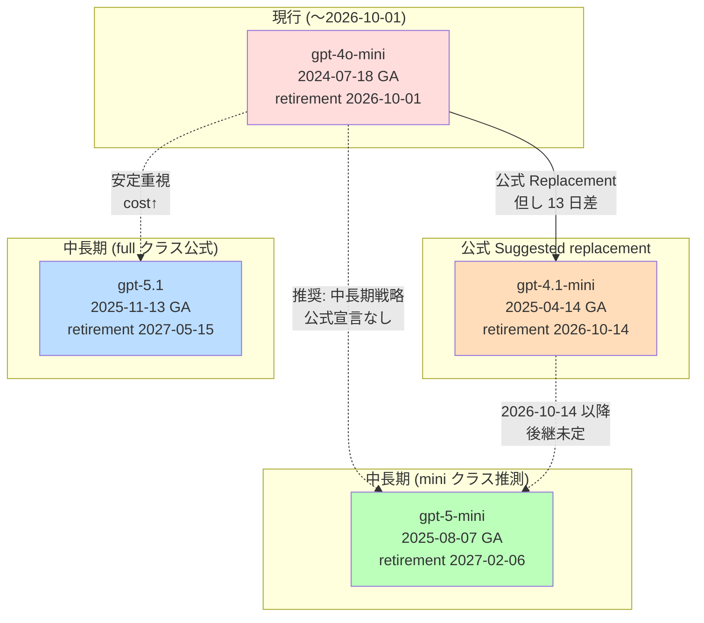

# Research: azure openai gpt 4 1 mini 2026 10 14 gpt 4o mini g

*Generated: 2026/5/15 19:26:35*

---

# Azure OpenAI gpt-4.1-mini の廃止予定日 (2026-10-14) と gpt-4o-mini からの代替モデル調査

> 調査日: 2026-05-15  
> 情報源ポリシー: Microsoft / Azure 一次情報のみ (learn.microsoft.com、MicrosoftDocs/azure-ai-docs GitHub、Azure 公式 docs)

---

## Executive Summary

- **「Azure OpenAI の `gpt-4.1-mini` (version `2025-04-14`) の retirement date が 2026-10-14」は TRUE**。Microsoft 公式の Model Retirement Schedule ページに verbatim で記載されている[^1][^2][^3]。
- 同ページで **`gpt-4o-mini` (2024-07-18) の Suggested replacement は `gpt-4.1-mini`** と公式に明記されている[^4]。ただし `gpt-4o-mini` の retirement は **2026-10-01**、`gpt-4.1-mini` の retirement は **2026-10-14** であり、**移行先の寿命が約13日しか後ろにずれない**。`gpt-4.1-mini` は実質「中継点」にしかならない。
- 公式に「`gpt-4.1-mini` の Suggested replacement」は **未宣言 (`—`)**[^1]。Microsoft のポリシー上、後継は **retirement の 90〜120 日前 (2026 年 6〜7 月頃) に宣言予定**[^5]。
- 「`gpt-4.1-mini` を経由しない、より長期に使える代替」を一次情報から積極的に選ぶなら、**`gpt-5-mini` (2025-08-07, GA, retirement 2027-02-06)** が最も現実的な候補。Chat Completions API・Responses API 両対応で、軽量 (mini) クラス、寿命は `gpt-4o-mini` から +約16ヶ月延長[^6][^7]。長期重視なら **`gpt-5.1` (2025-11-13, GA, retirement 2027-05-15)** も視野に入る (gpt-4o (full) の公式後継として `gpt-5.1` が指定されている)[^4]。
- いずれの候補モデル (`gpt-4.1-mini` / `gpt-5-mini` / `gpt-5-nano` / `gpt-5.1`) も **Chat Completions API + `api-version` クエリパラメータ方式で呼び出し可能**[^7][^8][^9]。最新 GA `api-version` は **`2024-10-21`**[^8]、最新 preview は **`2025-04-01-preview`**[^10]。2025-08 以降の新世代 v1 API では `api-version` 自体を省略できる新しい呼び方も追加されている[^10]。

---

## 1. 「`gpt-4.1-mini` retirement = 2026-10-14」は本当か?

### 1.1 結論: **TRUE**

Microsoft 公式の **Model retirement schedule** に下記テーブルが掲載されている (verbatim)[^1][^2][^3]:

| Model | Version | Lifecycle | Retirement date | Replacement |
|---|---|---|---|---|
| `gpt-4.1` | 2025-04-14 | GA | **2026-10-14** | — |
| **`gpt-4.1-mini`** | **2025-04-14** | **GA** | **2026-10-14** | **—** |
| `gpt-4.1-nano` | 2025-04-14 | GA | **2026-10-14** | — |

### 1.2 ポリシー的な裏付け

Microsoft の現行 lifecycle policy は「**GA モデルの retirement date は launch から 18ヶ月後に programmatically 設定される**」と明記している[^5]:

> *"Retirement date (18 months out) is set programmatically and available via the Models API."*

`gpt-4.1-mini` の GA = 2025-04-14、+18ヶ月 = **2026-10-14**。ポリシー値とスケジュール表が完全一致する。

### 1.3 補強: ファインチューニング版の retirement date が逆算で一致

公式の Fine-tuned models テーブルでは下記が明示されている[^11]:

| Model | Version | Training retirement | Deployment retirement |
|---|---|---|---|
| `gpt-4.1-mini` | 2025-04-14 | No earlier than 2027-04-14 | **2027-10-14** |

ファインチューニング版の deployment retirement は base モデル retirement + 12ヶ月 (2026-10-14 + 12ヶ月 = 2027-10-14)、training retirement は + 6ヶ月 (2026-10-14 + 6ヶ月 = 2027-04-14) と完全一致しており、base = 2026-10-14 を間接的に裏付ける。

### 1.4 ドキュメント変遷の補足 (情報の鮮度)

- 初出 commit: 2025-04-17、`mrbullwinkle` による追加で当初は **「No earlier than April 11, 2026」** という soft な表現[^12]。
- その後、retirement 表の場所が `articles/ai-services/openai/concepts/model-retirements.md` から `articles/foundry/openai/includes/concepts-model-retirement-schedule-content.md` (Foundry パス) に移動し、現行版で **`2026-10-14` のハード日付**に更新されている[^2]。
- ライフサイクル方針も「typically one year out」→「365 days from launch」→「18 months out」と段階的に延長されている[^5][^13]。

---

## 2. `gpt-4o-mini` の公式 Suggested replacement と問題点

### 2.1 公式表記: `gpt-4.1-mini` が指定されている

Model Retirement Schedule での `gpt-4o-mini` 行 (verbatim)[^4]:

| Model | Version | Lifecycle | Retirement date | Replacement |
|---|---|---|---|---|
| `gpt-4o-mini` | 2024-07-18 | GA | **2026-10-01** | **`gpt-4.1-mini`** |

GitHub commit 履歴上、Suggested replacement が空欄から `gpt-4.1-mini (2025-04-14)` に変更されたのは **2025-05-07** (`f363f7f6`)[^14]。

### 2.2 問題: 移行先が13日後に同時退役する

| モデル | Retirement |
|---|---|
| `gpt-4o-mini` | **2026-10-01** |
| `gpt-4.1-mini` (公式 replacement) | **2026-10-14** |

差はわずか **13日**。コードを `gpt-4o-mini` → `gpt-4.1-mini` に書き換えても、2 週間後には再び移行が必要になる。`gpt-4.1-mini` 自身の Replacement 列は `—` で、2026 年 6〜7 月頃まで公式後継は宣言されない[^5]。

> 公式ポリシーの引用 (verbatim)[^5]:
> *"The official replacement model is selected and declared approximately 90–120 days before the retiring model's retirement date — not sooner."*

---

## 3. `gpt-4.1-mini` を経由しない、現実的な代替モデル

### 3.1 「mini クラス」モデル比較表 (一次情報ベース)

| モデル | snapshot | GA/Preview | Retirement | Context window | Modality | Chat Completions API | 公式 Suggested replacement 指定の有無 |
|---|---|---|---|---|---|---|---|
| `gpt-4o-mini` | 2024-07-18 | GA | 2026-10-01 | 128k in / 16k out | Text+Image in / Text out | ✅ | (これが移行元) |
| `gpt-4.1-mini` | 2025-04-14 | GA | 2026-10-14 | 最大 1,047,576 (global std) | Text+Image in / Text out | ✅ | ⭕ `gpt-4o-mini` の公式 replacement[^4] |
| `gpt-4.1-nano` | 2025-04-14 | GA | 2026-10-14 | 最大 1,047,576 (global std) | Text+Image in / Text out | ✅ | ❌ |
| **`gpt-5-mini`** | **2025-08-07** | **GA** | **2027-02-06** | 400k | Text+Image in / Text out | ✅ | ❌ (推測上の最有力候補) |
| `gpt-5-nano` | 2025-08-07 | GA | 2027-02-06 | 400k | Text+Image in / Text out | ✅ | ❌ |
| `gpt-5.1` | 2025-11-13 | GA | 2027-05-15 | (一覧に明記) | (同左) | ✅ | ⭕ `gpt-4o` (full) の公式 replacement[^4] |

(出典: Models 一覧 + Model Retirement Schedule[^6][^4])

### 3.2 推奨アプローチ (短期 / 中長期)

#### 短期 (2026-10-01 まで)
- 公式に従うなら **`gpt-4.1-mini`** に移行 (公式 Suggested replacement)。
- ただし上記の通り 13 日後に gpt-4.1-mini も退役するため、「短期しのぎ」と割り切る場合のみ妥当。
- 公式に明記されている根拠: ✅ `gpt-4o-mini` 行の Replacement 列に `gpt-4.1-mini`[^4]。

#### 中長期 (2027 年以降も使い続けたい場合)
**最も現実的**: **`gpt-5-mini` (2025-08-07)** に直接移行する。
- Retirement: **2027-02-06** (`gpt-4o-mini` から +約16ヶ月)[^6]。
- 同じ「mini」クラスで cost/perf 的にも近い。
- Chat Completions API + Responses API の両方に対応 (公式モデル一覧)[^6]。
- Reasoning 機能あり (高度化)。

**より長寿命を重視するなら**: **`gpt-5.1` (2025-11-13)**。
- Retirement: **2027-05-15** (mini クラスではないが、gpt-4o の公式後継として実証済みの安定モデル)[^4]。
- ただし mini クラスより推論コストは高い見込み。

> ⚠️ 注意: `gpt-5-mini` / `gpt-5.1` を `gpt-4.1-mini` の正式後継として Microsoft が公式宣言した文書は **現時点で存在しない (確認できず)**[^4][^5]。これらは「公式に明記なし、ポリシー (90〜120日前宣言) と現行 GA mini クラスの寿命から導出した推測」である点を明示する。

---

## 4. Chat Completions API + `api-version` で呼び出せるか

### 4.1 結論

候補モデルのうち、**`gpt-4.1-mini` / `gpt-5-mini` / `gpt-5-nano` / `gpt-5.1` / `gpt-4o-mini` / `gpt-4o` のいずれも Chat Completions API で呼び出し可能** (公式 Models 一覧で明示)[^6]。Responses API 専用なのは Codex / o3-pro / `gpt-5-codex` / `gpt-5.1-codex` 系などのコード特化系のみ[^6]。

### 4.2 最新 `api-version` の値 (verbatim)

| 種別 | 値 | 出典 |
|---|---|---|
| 旧来型 GA | **`2024-10-21`** | Azure OpenAI Service REST API reference[^8] |
| 旧来型 Preview | **`2025-04-01-preview`** | API version lifecycle ページ[^10] |
| 新世代 v1 GA (2025-08〜) | `api-version` 省略可 (デフォルト `v1`) | 同上[^10][^9] |
| 新世代 v1 Preview | `api-version=preview` | v1 Preview API Reference[^15] |

公式文言 (verbatim)[^8]:
> *"The rest of the article covers the GA release of the Azure OpenAI data plane inference specification, **`2024-10-21`**."*

### 4.3 公式リクエスト例

**従来型 (date-versioned):**

```http
POST https://{endpoint}/openai/deployments/{deployment-id}/chat/completions?api-version=2024-10-21
Content-Type: application/json

{
  "messages": [
    {"role": "system", "content": "you are a helpful assistant that talks like a pirate"},
    {"role": "user", "content": "can you tell me how to care for a parrot?"}
  ]
}
```

(出典[^8])

**新世代 v1 (2025-08 以降):**

```python
from openai import OpenAI
from azure.identity import DefaultAzureCredential, get_bearer_token_provider

token_provider = get_bearer_token_provider(
    DefaultAzureCredential(), "https://ai.azure.com/.default"
)

client = OpenAI(
    base_url="https://YOUR-RESOURCE-NAME.openai.azure.com/openai/v1/",
    api_key=token_provider,
)
completion = client.chat.completions.create(
    model="gpt-5-mini",  # deployment 名
    messages=[
        {"role": "system", "content": "You are a helpful assistant."},
        {"role": "user", "content": "Hello"}
    ]
)
```

(出典[^10])

### 4.4 旧 vs 新エンドポイントの違い

| 観点 | 旧 (`/openai/deployments/`) | 新 (`/openai/v1/`) |
|---|---|---|
| `api-version` | **必須** (例: `?api-version=2024-10-21`) | **任意** (省略時 `v1`)。Preview 機能は `?api-version=preview` |
| クライアント | `AzureOpenAI()` | `OpenAI()` (本家 OpenAI SDK 互換) |
| モデル指定 | URL パスの `{deployment-id}` | リクエスト body の `model` フィールド (deployment 名) |
| 導入時期 | 従来 | **2025年8月 GA**[^10] |

---

## 5. アーキテクチャ全体像



---

## 6. 主要一次情報 URL 一覧

| # | タイトル | URL |
|---|---|---|
| 1 | Model lifecycle and retirement (Azure AI Foundry) | https://learn.microsoft.com/azure/ai-foundry/concepts/model-lifecycle-retirement |
| 2 | Model retirement schedule (公開ページ) | https://learn.microsoft.com/azure/foundry/openai/concepts/model-retirement-schedule |
| 3 | Model retirement schedule (GitHub include 元) | https://raw.githubusercontent.com/MicrosoftDocs/azure-ai-docs/refs/heads/main/articles/foundry/openai/includes/concepts-model-retirement-schedule-content.md |
| 4 | Microsoft Foundry Models lifecycle and support policy | https://learn.microsoft.com/azure/ai-services/openai/concepts/model-retirements |
| 5 | Azure OpenAI Models 一覧 | https://learn.microsoft.com/azure/ai-services/openai/concepts/models |
| 6 | Azure OpenAI REST API reference (GA `2024-10-21`) | https://learn.microsoft.com/azure/ai-services/openai/reference |
| 7 | Azure OpenAI API version lifecycle / deprecation | https://learn.microsoft.com/azure/ai-services/openai/api-version-deprecation |
| 8 | Azure OpenAI v1 GA API reference | https://learn.microsoft.com/azure/ai-foundry/openai/latest |
| 9 | Azure OpenAI v1 Preview API reference | https://learn.microsoft.com/azure/ai-foundry/openai/reference-preview-latest |

---

## 7. Confidence Assessment

| 主張 | Confidence | 根拠 |
|---|---|---|
| `gpt-4.1-mini` の retirement = **2026-10-14** | **High** | 公式 Model retirement schedule 表に verbatim で記載 + 18ヶ月ポリシーと完全一致 + Fine-tuned models 表 (2027-10-14) と整合[^1][^2][^4][^5][^11] |
| `gpt-4o-mini` の公式 Suggested replacement = `gpt-4.1-mini` | **High** | 公式 retirement schedule の Replacement 列に明記 + GitHub commit `f363f7f6` (2025-05-07) で追加履歴を確認[^4][^14] |
| `gpt-4o-mini` の retirement = **2026-10-01** | **High** | 公式 retirement schedule + Fine-tuned 表 (2027-10-01) と整合[^4][^11] |
| `gpt-5-mini` の retirement = **2027-02-06** | **High** | 公式 retirement schedule 表に明記[^6] |
| `gpt-5-mini` を `gpt-4o-mini` の現実的な中長期代替として推奨 | **Medium (推測)** | 公式に Replacement 指定はなし。モデル一覧から「mini クラス・GA・最長寿命」で論理的に導出。Microsoft が将来的に同様の指定をするかは未確定[^4][^6] |
| 候補モデルすべて Chat Completions API 対応 | **High** | 公式 Models ページで各モデルに Chat Completions API 対応の記載あり[^6] |
| 最新 GA `api-version` = **`2024-10-21`** | **High** | REST API reference に verbatim 記載[^8] |
| `gpt-4.1-mini` の **後継**は未宣言 | **High** | Replacement 列が `—`、ポリシーで「90〜120 日前まで宣言しない」と明示[^4][^5] |

### 確認できなかった事項

- Azure Updates ページ上の正式アナウンスエントリ (JavaScript レンダリング依存のため fetch 不能)
- `gpt-4o` / `gpt-4o-mini` の Responses API 対応有無 (Models ページに明示記載なし)
- ドキュメント本体の "last updated" メタデータ (HTML head にしか出力されていない可能性)

---

## Footnotes

[^1]: Azure AI Foundry "Model lifecycle and retirement" ページ の Azure OpenAI 表で `gpt-4.1-mini | 2025-04-14 | GA | 2026-10-14 | —` を確認。 https://learn.microsoft.com/azure/ai-foundry/concepts/model-lifecycle-retirement
[^2]: Microsoft Foundry "Model retirement schedule" ページ (公開版) で同テーブルを verbatim 確認。 https://learn.microsoft.com/azure/foundry/openai/concepts/model-retirement-schedule
[^3]: 同テーブルの GitHub include 元 (raw)。 https://raw.githubusercontent.com/MicrosoftDocs/azure-ai-docs/refs/heads/main/articles/foundry/openai/includes/concepts-model-retirement-schedule-content.md
[^4]: 同 Model retirement schedule 上の `gpt-4o-mini | 2024-07-18 | GA | 2026-10-01 | gpt-4.1-mini` 行および `gpt-4o | ... | gpt-5.1` 行。 https://learn.microsoft.com/azure/foundry/openai/concepts/model-retirement-schedule
[^5]: Microsoft Foundry Models lifecycle and support policy ページ。"Retirement date (18 months out) is set programmatically and available via the Models API." と "official replacement model is selected and declared approximately 90–120 days before" を verbatim 引用。 https://learn.microsoft.com/azure/ai-services/openai/concepts/model-retirements
[^6]: Azure OpenAI Models 一覧ページ。`gpt-4.1-mini` / `gpt-5-mini` / `gpt-5-nano` / `gpt-5-codex` 等の Chat Completions / Responses API 対応有無の記載を確認。 https://learn.microsoft.com/azure/ai-services/openai/concepts/models
[^7]: 同 Models 一覧ページ。`gpt-5-mini (2025-08-07)` の "Reasoning / Chat Completions API / Responses API / Structured outputs / Text and image processing / Functions, tools, and parallel tool calling" を verbatim 確認。 https://learn.microsoft.com/azure/ai-services/openai/concepts/models
[^8]: Azure OpenAI Service REST API reference (GA `2024-10-21`)。"The rest of the article covers the GA release of the Azure OpenAI data plane inference specification, `2024-10-21`." を verbatim 引用 + Chat completions リクエスト例。 https://learn.microsoft.com/azure/ai-services/openai/reference
[^9]: Azure OpenAI v1 GA API Reference。"`api-version` query: No — `v1` if not otherwise specified." を verbatim 確認。 https://learn.microsoft.com/azure/ai-foundry/openai/latest
[^10]: Azure OpenAI API version lifecycle / deprecation。最新 preview `2025-04-01-preview` および新世代 v1 (2025-08〜) の解説 / Python サンプル。"`api-version` is no longer a required parameter with the v1 GA API." を verbatim 引用。 https://learn.microsoft.com/azure/ai-services/openai/api-version-deprecation
[^11]: Microsoft Foundry Models lifecycle ページの Fine-tuned models 表で `gpt-4.1-mini | 2025-04-14 | No earlier than 2027-04-14 | 2027-10-14`、`gpt-4o-mini | 2024-07-18 | No earlier than 2027-04-01 | 2027-10-01` を確認。 https://learn.microsoft.com/azure/ai-services/openai/concepts/model-retirements
[^12]: MicrosoftDocs/azure-ai-docs commit `2daa2ace73ff3e693376594c2515055b74932f9f` (2025-04-17) で `gpt-4.1-mini` を retirement 表に初追加 (当初 "No earlier than April 11, 2026")。 https://github.com/MicrosoftDocs/azure-ai-docs/commit/2daa2ace73ff3e693376594c2515055b74932f9f
[^13]: MicrosoftDocs/azure-ai-docs commit `5edcfa4f3c5911de1d869c7e26aa5a276cd77a30` (2025-06-18) でポリシーが「typically one year out」→「365 days from launch」に変更 (その後 18ヶ月へ更新)。 https://github.com/MicrosoftDocs/azure-ai-docs/commit/5edcfa4f3c5911de1d869c7e26aa5a276cd77a30
[^14]: MicrosoftDocs/azure-ai-docs commit `f363f7f65bb116db49ca2cd3127673f10bb30500` (2025-05-07) で `gpt-4o-mini` の Suggested replacement に `gpt-4.1-mini (2025-04-14)` を追加。 https://github.com/MicrosoftDocs/azure-ai-docs/commit/f363f7f65bb116db49ca2cd3127673f10bb30500
[^15]: Azure OpenAI v1 Preview API reference (`?api-version=preview` の使用例)。 https://learn.microsoft.com/azure/ai-foundry/openai/reference-preview-latest
